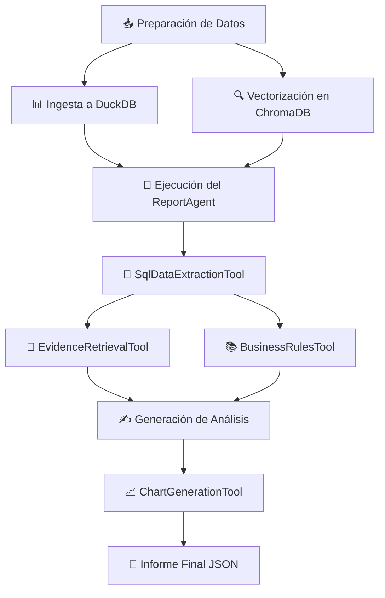

# 🧠 Report Generator
### Sistema Modular de Generación de Informes Ejecutivos y Técnicos

<div align="center">

[](https://www.python.org/downloads/)
[](LICENSE)
[]()

</div>

---

## 📋 Descripción General

**Report Generator** es un sistema inteligente orquestado por agentes que genera informes ejecutivos y técnicos de alta calidad a partir de múltiples fuentes de datos. El sistema integra hojas de cálculo Excel, evidencia multimodal (documentos e imágenes) y reglas de negocio para proporcionar análisis completos y accionables.

> 💡 **Nota**: Este documento ofrece una visión general del proyecto. Para obtener detalles más profundos, como los prompts utilizados, los contratos entre módulos y guías de integración extendidas, consulta la **Wiki del proyecto**.

---

## 📑 Tabla de Contenidos

- [🎯 Propósito y Alcance](#-propósito-y-alcance)
- [🏗️ Arquitectura y Componentes](#️-arquitectura-y-componentes)
- [🔄 Flujo Operativo End-to-End](#-flujo-operativo-end-to-end)
- [🚀 Instalación y Puesta en Marcha](#-instalación-y-puesta-en-marcha)
- [📁 Estructura del Proyecto](#-estructura-del-proyecto)
- [🔑 Configuración Clave](#-configuración-clave)
- [🪵 Observabilidad y Trazabilidad](#-observabilidad-y-trazabilidad)
- [🤝 Colaboración y Contribución](#-colaboración-y-contribución)

---

## 🎯 Propósito y Alcance

El objetivo principal de este proyecto es **generar informes detallados para consultores específicos**, integrando diversas fuentes de datos para proporcionar una visión completa y accionable.

### Capacidades Clave

| Capacidad | Descripción |
|-----------|-------------|
| **📊 Integración de Datos Estructurados** | Extracción de datos desde DuckDB filtrados por responsable |
| **🎨 Análisis de Evidencia Multimodal** | Procesamiento de documentos (PDF, DOCX) e imágenes organizados en ChromaDB |
| **🧠 Conocimiento de Negocio (RAG)** | Búsqueda semántica en base de conocimiento de reglas de negocio |
| **✨ Generación de Contenido con IA** | Síntesis de resúmenes ejecutivos utilizando LLM (Cerebras/Ollama) |
| **📈 Visualización de Datos** | Creación de gráficos (torta, barras) en formato JSON |

### Características Destacadas

- ✅ **Diseño extensible** para integración de nuevas herramientas
- ✅ **Soporte multi-proveedor** de IA (Cerebras, Ollama, Gemini)
- ✅ **Procesamiento multimodal** de texto e imágenes
- ✅ **Arquitectura modular** sin afectar funcionalidad existente

---

## 🏗️ Arquitectura y Componentes

El proyecto está organizado en capas bien definidas con responsabilidades claras:

### 1️⃣ Capa de Agentes (`app/agents`)

#### ReportAgent
Orquestador principal que:
- Analiza las solicitudes entrantes
- Decide qué herramientas utilizar en cada paso
- Ejecuta el plan de acción
- Compila el informe final

#### BaseAgent
Proporciona la lógica fundamental:
- Ciclo de razonamiento: **Pensamiento → Acción → Observación**
- Registro estructurado de logs
- Gestión de la memoria de ejecución
- Validación de acciones

---
### 2️⃣ Capa de Herramientas (`app/tools`)

Las herramientas son módulos funcionales que el ReportAgent puede invocar:

| Herramienta | Función |
|------------|---------|
| `SqlDataExtractionTool` | Genera y ejecuta consultas SQL sobre DuckDB para obtener datos de defectos |
| `EvidenceRetrievalTool` | Recupera chunks de evidencia multimodal desde ChromaDB |
| `BusinessRulesTool` | Realiza búsqueda semántica (RAG) para reglas de negocio |
| `SummaryGenerationTool` | Genera resúmenes ejecutivos utilizando el LLM |
| `RecommendationsGenerationTool` | Produce recomendaciones técnicas especializadas |
| `ChartGenerationTool` | Transforma datos tabulares en objetos de visualización JSON |
---

### 3️⃣ Capa de ETL y Vectorización (`app/core/etl`)

Procesa datos crudos y los prepara para su uso:

```
📥 INGESTA DE DATOS
├── Excel → DuckDB
│   └── Limpieza de columnas y contenido textual
├── Knowledge Base (SQL)
│   └── Generación de Markdown optimizado para vectorización
├── Business Rules (PDF/TXT/MD)
│   └── Segmentación y vectorización en ChromaDB
└── Evidencia Multimodal (DOCX, PDF, Imágenes)
    └── Extracción de texto, tablas y descripción de imágenes
```

---

### 4️⃣ Capa de Proveedores de IA (`app/core/ia`)

Abstrae la comunicación con modelos de IA:

| Tipo | Proveedores Compatibles |
|------|------------------------|
| **LLM** | Cerebras (API), Ollama (local) |
| **Embeddings** | Gemini (API), Ollama (local) |
| **Visión** | Ollama (descripción de imágenes) |

---

### 5️⃣ Capa de Persistencia de Datos

- **DuckDB**: Datos estructurados de Excel  
  📂 `data_store/etl_store/duckdb_data`

- **ChromaDB**: Base de datos vectorial  
  📂 `data_store/etl_store/vector_store`

---

## 🔄 Flujo Operativo End-to-End



### Proceso Detallado

#### **Fase 1: Preparación de Datos (ETL)**
1. Carga de archivos Excel en carpeta `uploads`
2. Ingesta en DuckDB
3. Procesamiento de reglas de negocio y evidencia multimodal
4. Vectorización y almacenamiento en ChromaDB

#### **Fase 2: Ejecución del Agente**
1. Invocación del ReportAgent con nombre del consultor
2. Extracción de datos de defectos desde DuckDB
3. Recuperación de evidencia multimodal asociada
4. Búsqueda de reglas de negocio relevantes
5. Generación de análisis y recomendaciones
6. Creación de visualizaciones

#### **Fase 3: Resultado**
- Compilación de resultados en JSON estructurado
- Incluye: resumen, recomendaciones, datos de soporte y gráficos

---

## 🚀 Instalación y Puesta en Marcha

### Prerrequisitos

| Requisito | Versión | Descripción |
|-----------|---------|-------------|
| **Python** | 3.10+ | Lenguaje base del proyecto |
| **Git** | Latest | Control de versiones |
| **Ollama** | Latest | (Opcional) Modelos de IA locales |

### Paso 1️⃣: Clonar el Repositorio

```bash
git clone <URL_DEL_REPOSITORIO>
cd report_generator_demo
```

### Paso 2️⃣: Configurar el Entorno Virtual

```bash
# Crear entorno virtual
python -m venv venv

# Activar entorno virtual
# Windows:
venv\Scripts\activate

# macOS/Linux:
source venv/bin/activate
```

### Paso 3️⃣: Instalar Dependencias

```bash
pip install -r requirements.txt
```

### Paso 4️⃣: Crear Estructura de Directorios

```bash
python scripts/setup_project.py
```

### Paso 5️⃣: Configurar Variables de Entorno

Crea un archivo `.env` en la raíz del proyecto:

```env
# === PROVEEDORES DE IA ===
LLM_PROVIDER="ollama"                 # O "cerebras"
EMBEDDING_PROVIDER="ollama"           # O "gemini"
VISION_PROVIDER="ollama"

# === MODELOS ===
LLM_MODEL_NAME="llama-3.3-70b"
EMBEDDING_MODEL="nomic-embed-text"
VISION_MODEL_NAME="gemma3:4b"

# === CLAVES DE API ===
CEREBRAS_API_KEY="TU_API_KEY_DE_CEREBRAS"
GEMINI_API_KEY="TU_API_KEY_DE_GEMINI"

# === CONFIGURACIÓN OLLAMA ===
OLLAMA_HOST="http://localhost:11434"

# === SELENIUM (Extracción de Evidencia) ===
DEBUGGER_ADDRESS="localhost:9222"
DEBUG_MODE="False"
```

### Paso 6️⃣: Instalar Modelos de Ollama (Opcional)

```bash
ollama pull nomic-embed-text
ollama pull gemma3:4b
```

### Paso 7️⃣: Ejecución

```bash
# Ejecutar pipelines de ETL,
cd ./scripts/test/vectorize
python -m scripts.test.vectorize.debug_multimodal_pipeline

# Generar informes
cd ./scripts
python generate_report_v2.py --consultant "YARLEN ASTRID ALVAREZ BUILES (203)" --print-summary
```

---

## 📁 Estructura del Proyecto

```
report_generator_demo/
│
├── app/                          # Núcleo de la aplicación
│   ├── agents/                   # Lógica de agentes
│   │   ├── base_agent.py
│   │   └── report_agent.py
│   ├── tools/                    # Herramientas especializadas
│   ├── core/                     # Componentes centrales
│   │   ├── etl/                  # Scripts de ingesta y vectorización
│   │   ├── ia/                   # Abstracciones de proveedores IA
│   │   └── report_generator/    # RAG, prompts y gráficos
│   └── config/                   # Archivos de configuración
│
├── data_store/                   # Almacén de datos persistentes
│   ├── etl_store/
│   │   ├── duckdb_data/          # Base de datos DuckDB
│   │   └── vector_store/         # Vectores ChromaDB
│   └── logs/                     # Logs estructurados
│
├── scripts/                      # Scripts de utilidad
│   ├── setup_project.py
│   ├── run_etl.py
│   └── generate_report.py
│
├── .env                          # Variables de entorno
├── requirements.txt              # Dependencias Python
└── README.md                     # Este archivo
```

---

## 🔑 Configuración Clave

| Archivo | Propósito |
|---------|-----------|
| `app/config/settings.py` | Proveedores de IA, modelos y límites de procesamiento |
| `app/config/settings_etl.py` | Rutas del data_store, ubicación de DuckDB y colecciones ChromaDB |
| `.env` | Variables de entorno sensibles (claves de API) |

---

## 🪵 Observabilidad y Trazabilidad

El proyecto incluye un sistema de logging robusto:

### Características de Logging

- ✅ **Logs Estructurados**: Cada flujo genera logs detallados en `data_store/logs`
- ✅ **Metadatos de Ejecución**: Archivos JSON con pasos ejecutados, tiempos y resultados
- ✅ **Logs de Vectorización**: Logs específicos de ETL en `data_store/logs_vectorization`
- ✅ **Trazabilidad Completa**: Seguimiento de cada operación del agente

### Ubicación de Logs

```
data_store/
├── logs/                         # Logs de ejecución general
└── logs_vectorization/           # Logs de procesos ETL
```

---

## 🤝 Colaboración y Contribución (Resivar wiki)

### Directrices de Contribución

#### ✅ Commits Atómicos
Realiza cambios pequeños y descriptivos con mensajes claros:
```
feat: agregar soporte para archivos CSV
fix: corregir error en extracción de imágenes
docs: actualizar README con nuevas instrucciones
```

#### ✅ Pull Requests Detallados
Cada PR debe incluir:
- 📝 Descripción clara del propósito
- 🎯 Impacto en el sistema
- ✔️ Validaciones realizadas
- 🧪 Casos de prueba

#### ✅ Validación Mínima
Antes de enviar un PR:
1. Ejecuta los pipelines de ETL
2. Verifica la generación de informes
3. Revisa los logs de ejecución
4. Valida que no hay regresiones

#### ✅ Estilo de Código
- Sigue los patrones de nombres existentes
- Mantén la modularidad
- Documenta funciones complejas
- Utiliza type hints en Python

---

## 📚 Recursos Adicionales

- 📖 **Wiki del Proyecto**: Documentación detallada de prompts y contratos
---


[⬆ Volver arriba](#-report-generator)